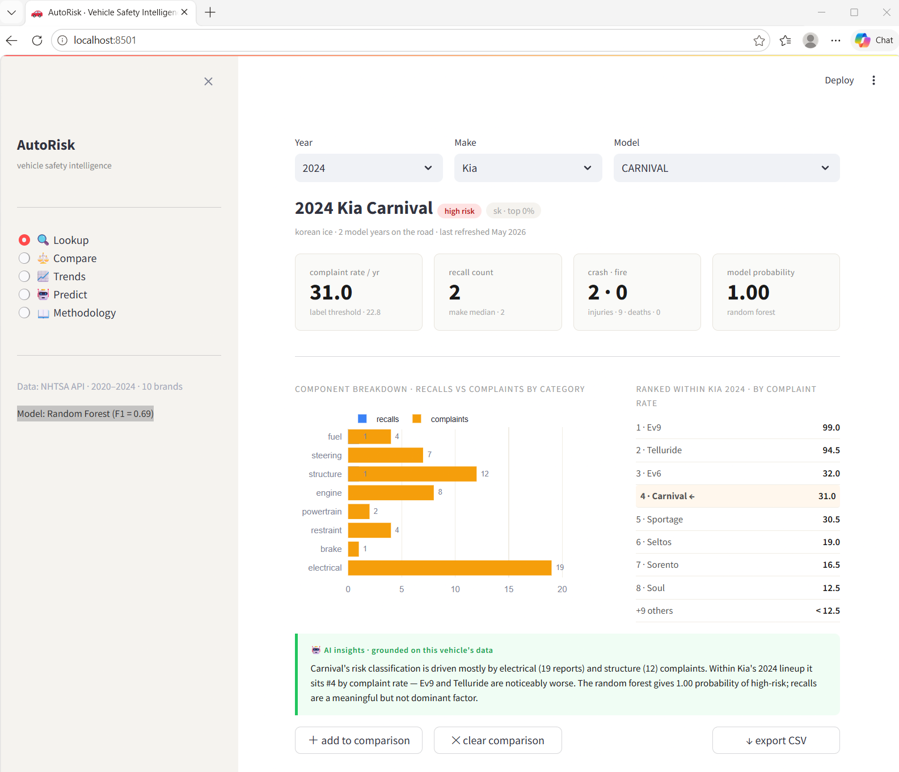
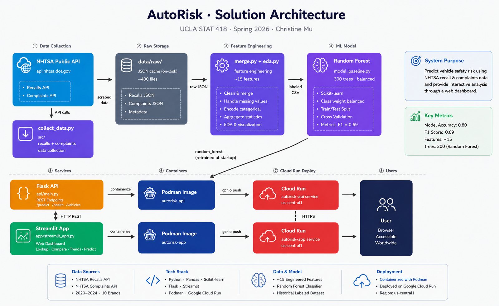
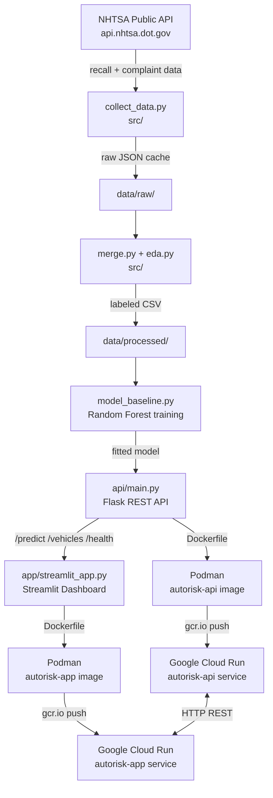

# AutoRisk · Vehicle Safety Intelligence

> UCLA STAT 418 — Final Project · Spring 2026 · Ning Mu

AutoRisk predicts whether a vehicle (year × make × model) falls in the **high-complaint-rate** risk group using NHTSA recall data and a Random Forest classifier. The project covers the full ML lifecycle: data collection via public APIs → EDA → modeling → REST API → interactive Streamlit dashboard → container deployment on Google Cloud Run.

---

## Live Services

| Service | URL |
|---|---|
| Streamlit App | https://autorisk-app-nvf6olmxaa-uc.a.run.app |
| Flask Model API | https://autorisk-api-nvf6olmxaa-uc.a.run.app |
| API Health Check | https://autorisk-api-nvf6olmxaa-uc.a.run.app/health |

---

## Dashboard Preview



> **Lookup tab** — select any year/make/model to see complaint rate, recall breakdown, component chart, and model risk probability.

---

## Solution Architecture






---

## Repo Layout

```
AutoRisk/
├── README.md
├── docker-compose.yml          # podman-compose / docker compose
├── build_and_run.sh            # Podman build + GCR push + Cloud Run deploy
│
├── api/
│   ├── main.py                 # Flask API: /predict /health /vehicles
│   ├── requirements.txt
│   └── Dockerfile
│
├── app/
│   ├── streamlit_app.py        # Dashboard: Lookup, Compare, Trends, Predict
│   ├── requirements.txt
│   └── Dockerfile
│
├── src/
│   ├── collect_data.py         # NHTSA API scraper with on-disk cache
│   ├── merge.py                # joins recalls + complaints into feature table
│   ├── eda.py                  # EDA figures + risk label creation
│   └── model_baseline.py       # Logistic Regression + Random Forest training
│
├── data/
│   ├── raw/                    # cached JSON from NHTSA API
│   └── processed/
│       ├── vehicle_risk_features_labeled.csv   # training data (817 rows)
│       ├── model_baseline_metrics.csv
│       └── random_forest_feature_importance.csv
│
└── figures/                    # EDA + model evaluation charts (01–10)
```

---

## Quickstart

### 1. Install & run locally

```bash
# API (terminal 1)
pip install -r api/requirements.txt
python api/main.py
# → http://localhost:8080

# App (terminal 2)
pip install -r app/requirements.txt
API_URL=http://localhost:8080 streamlit run app/streamlit_app.py
# → http://localhost:8501
```

### 2. Run with Podman (both services together)

```bash
# install podman-compose if needed:  pip install podman-compose
podman-compose up --build
```

### 3. Deploy to Google Cloud Run

```bash
GCP_PROJECT=autorisk bash build_and_run.sh push
```

---

## Data Collection

Data pulled from two NHTSA API endpoints (no API key required):

| Endpoint | What it returns |
|---|---|
| `/api/complaints/complaintsByVehicle` | consumer complaints with component category |
| `/api/recalls/recallsByVehicle` | recall campaigns with component category |

**Scope**: 2020–2024 model years × 10 makes → **817 (year, make, model)** rows after deduplication.

```bash
python src/collect_data.py                                         # full (~20-40 min)
python src/collect_data.py --years 2022 2023 --makes Toyota Honda  # pilot (~2 min)
python src/eda.py          # generate figures + labeled CSV
python src/model_baseline.py   # train + evaluate
```

---

## Modeling

**Risk label**: a vehicle is high-risk (1) if its annual complaint rate exceeds the dataset median threshold (~22.75 complaints/yr). Class balance: ~38% positive.

**Features** (complaint-derived columns excluded to prevent data leakage):
- `recall_count` and per-component recall counts
- `year`, `vehicle_age`, `make`, `brand_category`

| Model | Accuracy | Precision | Recall | F1 |
|---|---|---|---|---|
| Logistic Regression | 0.73 | 0.55 | 0.63 | 0.59 |
| **Random Forest** | **0.80** | **0.65** | **0.74** | **0.69** |

Random Forest (300 trees, balanced class weights) is used in production. Top features: recall count, electrical recalls, vehicle age, powertrain recalls.

---

## API Reference

### `GET /health`
```json
{"status":"ok","model":"random_forest","test_accuracy":0.8,"test_f1":0.69}
```

### `GET /vehicles`
All (year, make, model) combinations in training data.

### `GET /vehicles/stats?year=2022&make=Toyota&model=CAMRY`
Full feature row for a specific vehicle.

### `POST /predict`
```json
// request
{"year":2022,"make":"Toyota","recall_count":3,"recall_electrical_count":1,"recall_brake_count":0,"recall_restraint_count":1,"recall_powertrain_count":1}

// response
{"high_risk_probability":0.82,"prediction":1,"label":"high-risk","vehicle_age":4}
```

---

## Deployment (Podman + Google Cloud Run)

```bash
# build both images
podman build -f api/Dockerfile -t autorisk-api:latest .
podman build -f app/Dockerfile -t autorisk-app:latest .

# tag + push to GCR
podman tag autorisk-api:latest gcr.io/autorisk/autorisk-api:latest
podman push gcr.io/autorisk/autorisk-api:latest

podman tag autorisk-app:latest gcr.io/autorisk/autorisk-app:latest
podman push gcr.io/autorisk/autorisk-app:latest

# deploy API
gcloud run deploy autorisk-api \
  --image gcr.io/autorisk/autorisk-api:latest \
  --region us-central1 --allow-unauthenticated --port 8080 --memory 1Gi

# deploy App (pass API URL as env var)
gcloud run deploy autorisk-app \
  --image gcr.io/autorisk/autorisk-app:latest \
  --region us-central1 --allow-unauthenticated --port 8501 --memory 1Gi \
  --set-env-vars API_URL=https://autorisk-api-nvf6olmxaa-uc.a.run.app
```

Or use the helper script: `bash build_and_run.sh push`

---

## AI Assistant Usage

This project used **Claude (Anthropic)** throughout development.

| Task | What AI did |
|---|---|
| Feature engineering review | Flagged complaint-rate leakage before it was caught manually |
| Streamlit dashboard | Generated full multi-page layout from a mockup image |
| Flask API | Scaffolded `/predict` with input validation and fallback logic |
| Dockerfile + compose | Produced Podman-compatible multi-service config |
| README architecture diagram | Wrote the Mermaid diagram from a component description |

**Useful prompts:**
- *"Given risk_label is derived from complaint_rate, which columns would cause data leakage?"*
- *"Generate a Streamlit app matching this mockup [image]. Use Plotly for charts."*
- *"Write a Flask endpoint that accepts recall counts and returns RF prediction probability."*

**Where AI needed correction:** NHTSA API parameter names (corrected from official docs), radar chart normalization in Compare tab, single-page → multi-page Streamlit restructure.

**Lesson:** AI assistants accelerate boilerplate (Docker, scaffolding, diagrams). Domain correctness (API schemas, leakage checks) still requires human review.

---

## Requirements

- Python 3.11+
- Podman + podman-compose (or Docker + docker compose)
- Google Cloud SDK for deployment
- NHTSA API: public, no key required
