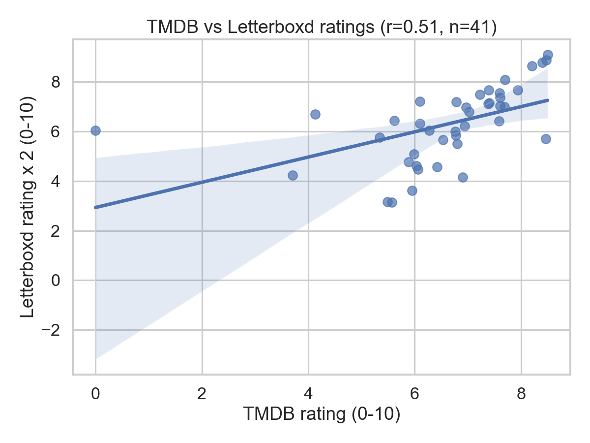
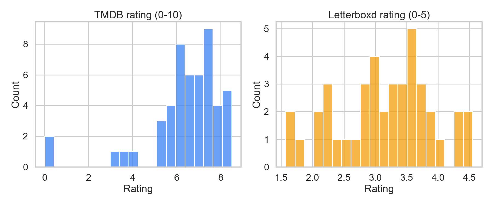
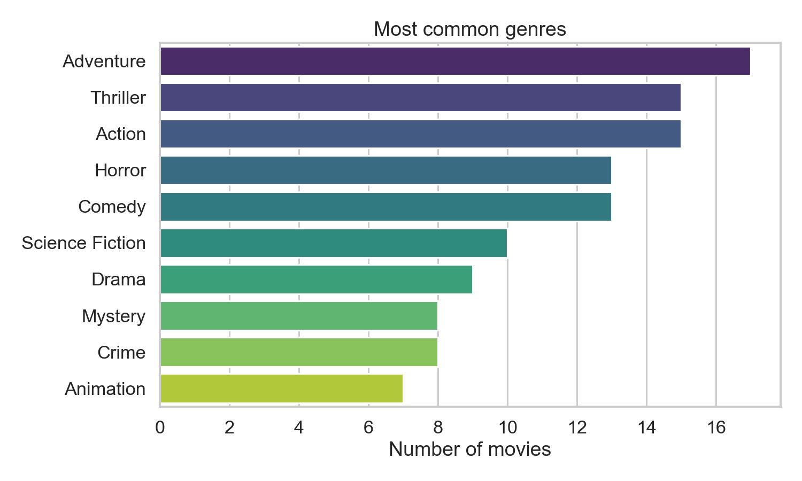
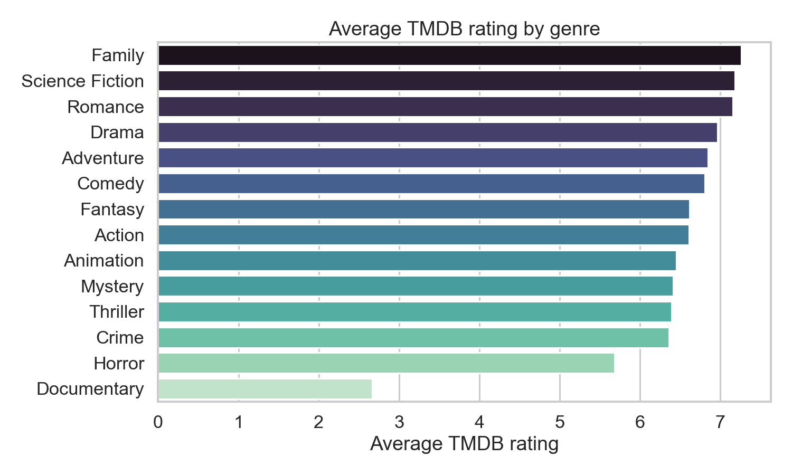
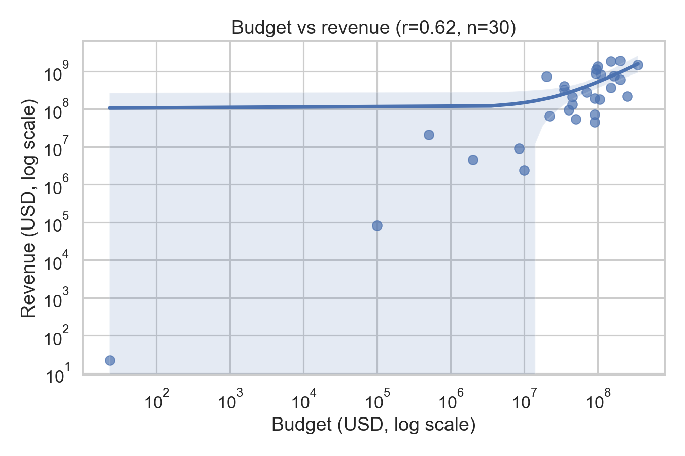
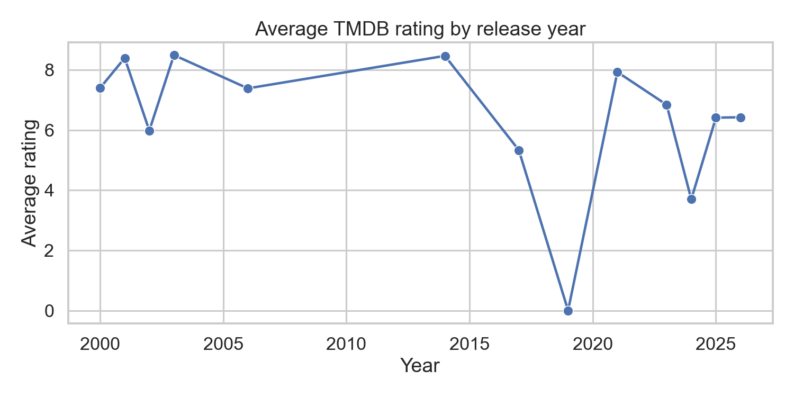

# Homework 2 — Analysis Report

**Author:** Ning Mu(nmu414@gucla.edu)
**Course:** UCLA STAT 418 — Spring 2026
**Pipeline run:** 2026-04-27
**Data:** 50 movies from TMDB `/movie/popular` + Letterboxd film pages

## 1. Data collection summary

I collected metadata for **50 movies** from two sources:

* **TMDB v3 API** — 50/50 records, fully enriched with `/movie/{id}` details
  and top-5 cast / top-5 crew from `/movie/{id}/credits`.
  I limited requests to about 3 per second to avoid hitting TMDB limits.
  One JSON file per movie sits in `data/raw/tmdb/`.
* **Letterboxd film pages** — **50/50 successfully scraped**. The scraper
  honored Letterboxd's `robots.txt` (general-public policy allows `/film/`),
  identified itself with `UCLA STAT418 Student - nmu414@ucla.edu`, and
  slept ≥2 s between requests. Of the 50 scraped pages, **41 returned an
  average rating** and 9 returned `None` because the films are unreleased
  2025–2026 titles with no ratings yet (e.g. *Balls Up*, *Psycho Killer*,
  *Avatar Aang: The Last Airbender*). The same nine also have very low or
  zero fan counts.

The merged tidy table at `data/processed/movies.csv` has **50 rows × 21
columns**, including `tmdb_rating`, `letterboxd_rating`, `letterboxd_fans`,
`budget`, `revenue`, `profit`, `roi`, and lists of genres / cast / crew.

Sample composition is heavily skewed toward recent English-language
blockbusters, as expected from `/movie/popular`:

* Year range: **2000 – 2026**, mean ≈ 2023.
* Original language: 42 English, 3 Spanish, 1 each of Italian, Japanese,
  Mandarin, Russian, Hindi.
* Mean runtime 113 min, median 106 min.

## 2. Analysis findings

I picked **three** of the four suggested questions and added a temporal
trend chart as a bonus.

### 2.1 Ratings: TMDB vs Letterboxd

After rescaling Letterboxd's 0–5 to 0–10 (× 2), the Pearson correlation
between the two platforms over the 41-film overlap is

$$ r = 0.51 \quad (n = 41) $$

which suggests a moderate positive relationship. The two communities agree
on the ranking *direction* but Letterboxd grades noticeably more harshly:
TMDB's mean is **6.42** (on 0–10) while Letterboxd's mean is 
**3.15 × 2 = 6.30** (on 0–10). The spread is also tighter on Letterboxd 
(σ ≈ 0.76 × 2 = 1.52) than on TMDB (σ ≈ 1.75), suggesting Letterboxd's 
audience clusters around the middle while TMDB's voters are more polarized.

The five Letterboxd-favorite films in the sample all have TMDB ratings
above 7.7:

| Title | TMDB | Letterboxd |
|---|---:|---:|
| The Lord of the Rings: The Return of the King | 8.50 | 4.55 |
| Interstellar | 8.47 | 4.44 |
| The Lord of the Rings: The Fellowship of the Ring | 8.40 | 4.39 |
| Project Hail Mary | 8.21 | 4.32 |
| Demon Slayer: Kimetsu no Yaiba Infinity Castle | 7.70 | 4.04 |

The bottom five on Letterboxd, by contrast, are all recent low-budget
horror or thriller releases (e.g. *The Strangers: Chapter 3* at 1.57, *The
Mortuary Assistant* at 1.58).

### 2.2 Genres

The "popular" endpoint over-represents action-driven and event-movie
genres. The five most common genres in the sample are:

| Genre | Films |
|---|---:|
| Adventure | 17 |
| Thriller | 15 |
| Action | 15 |
| Horror | 13 |
| Comedy | 13 |

Average TMDB rating tells a different story (genres restricted to ≥2 films):

| Highest | Mean TMDB | n |
|---|---:|---:|
| Family | 7.26 | 6 |
| Science Fiction | 7.18 | 10 |
| Romance | 7.15 | 3 |
| Drama | 6.96 | 9 |
| Adventure | 6.85 | 17 |

| Lowest | Mean TMDB | n |
|---|---:|---:|
| Horror | 5.69 | 13 |
| Documentary | 2.67 | 2 |

Horror is the largest-and-lowest-rated combination — a familiar pattern
in popular cinema where many low-budget horror titles get wide streaming
distribution but middling reviews. Documentary's mean of 2.67 is driven
by only two titles, so it should be read as a curiosity, not a trend.

### 2.3 Budget vs revenue

Of the 50 films, **30** had non-zero budget and revenue figures (the
remaining 20 had `0` reported on TMDB, which I treat as missing rather
than literal zero). Across those 30, the Pearson correlation between
budget and revenue is

$$ r = 0.62 \quad (n = 30) $$

— a strong positive relationship: bigger productions earn more on
average, but with substantial spread, especially on the upside (one
film can still 10× its budget). The plot uses log-log axes to keep
small and large productions visible at the same time.

The ten most profitable films in the sample (revenue − budget) are all
either franchise releases or animation:

| Rank | Title | Budget | Revenue | Profit |
|---:|---|---:|---:|---:|
| 1 | Spider-Man: No Way Home | $200M | $1.92B | $1.72B |
| 2 | Zootopia 2 | $150M | $1.87B | $1.72B |
| 3 | The Super Mario Bros. Movie | $100M | $1.36B | $1.26B |
| 4 | Avatar: Fire and Ash | $350M | $1.49B | $1.14B |
| 5 | The Lord of the Rings: The Return of the King | $94M | $1.12B | $1.02B |
| 6 | The Lord of the Rings: The Fellowship of the Ring | $93M | $871M | $778M |
| 7 | The Super Mario Galaxy Movie | $110M | $831M | $721M |
| 8 | Demon Slayer: Kimetsu no Yaiba Infinity Castle | $20M | $733M | $713M |
| 9 | Interstellar | $165M | $747M | $582M |
| 10 | Project Hail Mary | $200M | $613M | $413M |

*Demon Slayer: Infinity Castle* is the standout return-on-investment:
$20M budget produced $733M in revenue (≈ 36×). Most of the rest are
established IP with budgets in the $90–350M range.

### 2.4 Bonus — rating trend over time

Average TMDB rating per release year (one line, marked at each year
present in the sample) shows no monotonic trend; recent years are noisy
because the popular endpoint pulls in many 2025–2026 titles, some of
which have very few votes.

## 3. Interesting insights

* **Audiences agree directionally, but Letterboxd is the tougher grader.**
  *r ≈ 0.51* tells us TMDB and Letterboxd are not interchangeable —
  Letterboxd users (typically a more cinephile-leaning crowd) average
  about half a star lower than the TMDB community on the same films
  once scales are aligned.
* **Engagement scales non-linearly.** *Interstellar* has 512K Letterboxd
  fans, more than 4× the next highest (*The Return of the King* at
  124K). Sci-fi prestige titles seem to anchor the platform's
  engagement.
* **Horror dominates count, sci-fi/family dominate ratings.** Horror is
  the single largest genre in the sample (13 films) and the second
  lowest-rated. Sci-fi and family films are smaller in count but score
  highest. The popular endpoint is good at finding which films are
  *watched*, less good at finding which ones are *loved*.
* **Unreleased films expose a robustness risk.** Nine titles were
  2025–2026 releases that scraped successfully but had no Letterboxd
  rating yet. The processor handles this gracefully (NaN merge), but
  a future iteration should filter out unreleased films at collection
  time.

## 4. Challenges encountered and solutions

* **`RobotFileParser` returned `disallow_all = True` even though
  Letterboxd allows `/film/`.** The default `RobotFileParser.read()`
  uses `urllib.request.urlopen`, which sends a `Python-urllib/X.Y` user
  agent. Letterboxd 403s that UA, and CPython's parser reacts to 401/
  403 by setting `disallow_all = True`, which makes `can_fetch()`
  return False for every path. Fix: I fetch `robots.txt` explicitly
  with `self.session` (which carries the descriptive UCLA UA) and feed
  the body to `rp.parse()`. Real disallow rules still abort the run;
  fetch-level 403s no longer cause a phantom shutdown.
* **Letterboxd slug heuristics.** Slugs are sometimes hand-curated
  (e.g. disambiguated by year). My `_slugify_title` heuristic worked
  on every popular title in this sample, partly because /film/<slug>/
  redirects to the canonical page when there's a near-match.
* **TMDB zero-budget pollution.** Many older films report `budget = 0`
  and `revenue = 0` even when both are well known. The processor
  treats those as missing instead of literal zeros, which keeps
  correlation calculations honest at the cost of a smaller financial
  sample (30 of 50).
* **Title collisions on merge.** Direct title-string joins broke on
  punctuation and apostrophes. Normalizing both sides to lowercase
  alphanumerics before joining fixed it.

## 5. Limitations and future improvements

* **Sample selection.** Fifty `/movie/popular` titles are heavily
  biased toward recent, English-language, US-distributed blockbusters
  (84 % of the sample). A representative comparison of TMDB vs
  Letterboxd would draw from `/discover/movie` with stratified
  sampling across years, languages, and genres.
* **Slug accuracy.** Following Letterboxd's `?tmdb=<id>` redirect or
  using their public TMDB-ID endpoint would replace the heuristic
  slug with an exact lookup, removing the 404 risk entirely.
* **Single rating snapshot.** Both platforms' ratings drift daily.
  Logging timestamps with each request would let a re-run compare the
  same film across dates.
* **Statistical rigor.** Pearson r = 0.51 on n = 41 is noisy.
  Bootstrapped confidence intervals or a non-parametric Spearman rank
  correlation would communicate the uncertainty more honestly.
* **Unreleased-title handling.** Future runs should filter out films
  with `release_date > today` at the TMDB collection stage so the
  Letterboxd scrape only targets pages that can plausibly have data.
