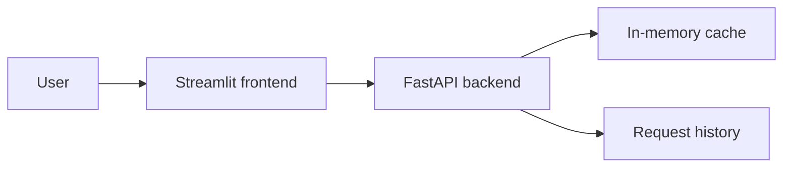
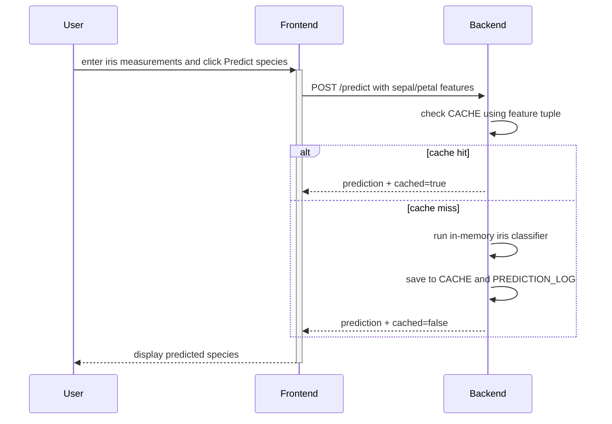

# Full-Stack App Example

This example demonstrates a compact full-stack data application built from two services:

- a FastAPI backend
- a Streamlit frontend

It is designed for teaching deployment structure, service boundaries, containerization, and simple CI for a multi-service project.

## What this example includes

```text
fullstack-app/
├── backend/
│   ├── main.py
│   ├── test_main.py
│   ├── pyproject.toml
│   ├── uv.lock
│   └── Dockerfile
├── frontend/
│   ├── app.py
│   ├── pyproject.toml
│   ├── uv.lock
│   └── Dockerfile
├── docker-compose.yml
├── ci.yml
└── README.md
```

## Architecture



This version is intentionally lightweight:
- no database
- no Redis
- no external model service

That keeps the example runnable in a single class session while still showing the shape of a real full-stack system.

## Mermaid diagrams used in the lecture

The week 9 slides can point directly at this example because the architecture diagram is already written as Mermaid.

### Component diagram


### Request flow for `/predict`



## Backend behavior

The backend exposes:

- `GET /health`
- `POST /predict`
- `GET /history`

### `/predict`

The backend accepts iris-style numeric inputs and returns:

- a species prediction
- a `cached` flag showing whether the result came from a simple in-memory cache

Example request:

```bash
curl -X POST http://localhost:8000/predict \
  -H "Content-Type: application/json" \
  -d '{
    "sepal_length": 5.1,
    "sepal_width": 3.5,
    "petal_length": 1.4,
    "petal_width": 0.2
  }'
```

Example response shape:

```json
{
  "sepal_length": 5.1,
  "sepal_width": 3.5,
  "petal_length": 1.4,
  "petal_width": 0.2,
  "prediction": "setosa",
  "cached": false
}
```

### `/history`

The backend also stores recent requests in memory so the frontend can display a history view.

## Frontend behavior

The Streamlit app provides:

- numeric input widgets for iris features
- a button to submit a prediction request
- a display of the predicted species and cache flag
- a JSON view of the latest backend response
- a simple history panel populated from the backend

The frontend calls the backend using the `BACKEND_URL` environment variable.

## Local Python setup with uv

### Backend

```bash
cd week-9/examples/fullstack-app/backend
uv sync
uv run python main.py
```

### Frontend

In a separate terminal:

```bash
cd week-9/examples/fullstack-app/frontend
uv sync
BACKEND_URL=http://localhost:8000 uv run streamlit run app.py
```

Then open:

- backend docs: `http://localhost:8000/docs`
- frontend app: `http://localhost:8501`

## Run with containers

From `week-9/examples/fullstack-app/`:

```bash
podman-compose up --build
```

Or with Docker Compose:

```bash
docker compose up --build
```

The backend and frontend images install dependencies with `uv sync --no-dev` during build.

Expected services:

- frontend: `http://localhost:8501`
- backend: `http://localhost:8000`

## Backend tests

The backend includes pytest tests for:

- health endpoint behavior
- prediction responses
- cache reuse on repeated requests
- history tracking

Run them with:

```bash
cd week-9/examples/fullstack-app/backend
uv run pytest -q
```

## CI workflow

The `ci.yml` file demonstrates a simple multi-service workflow:

- sync backend dependencies with `uv`
- run backend tests
- sync frontend dependencies with `uv`
- perform a frontend smoke check with `py_compile`

This is enough to teach the idea that different services in one repository may have different validation steps.

